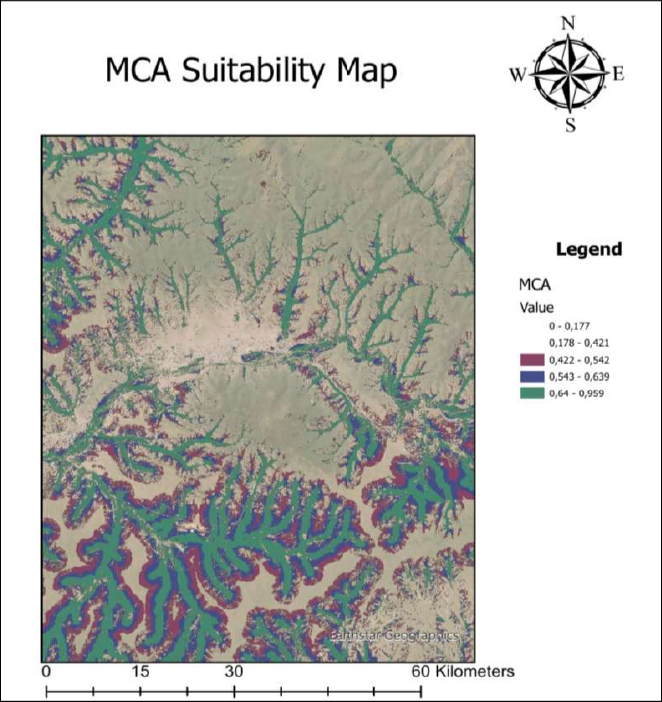
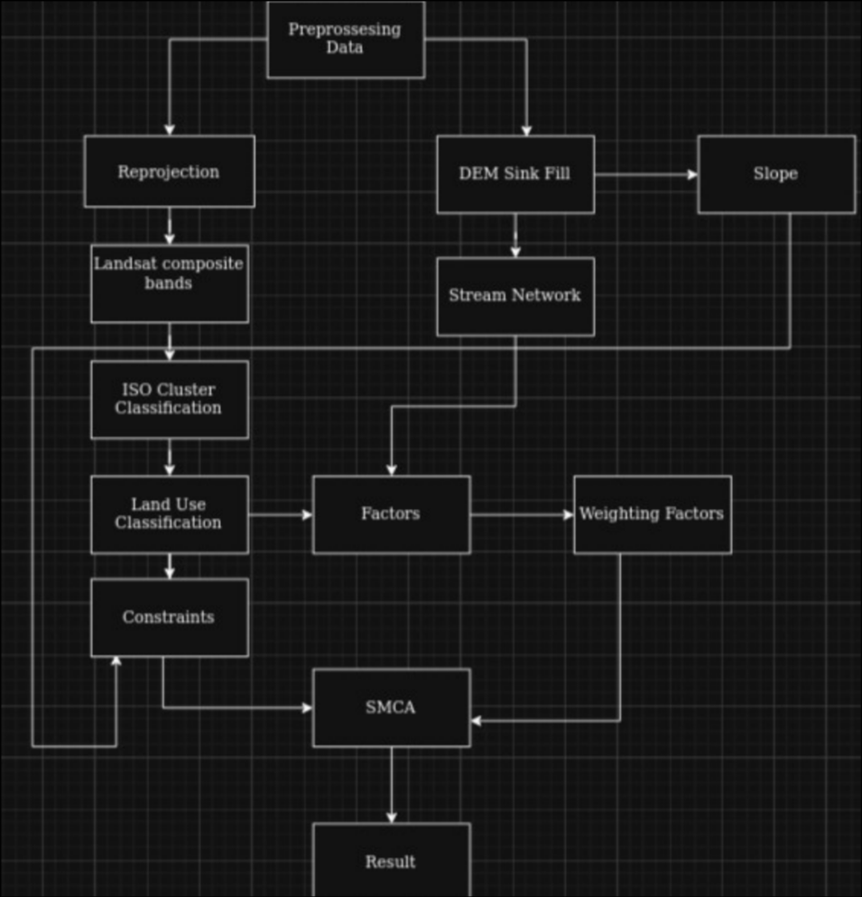
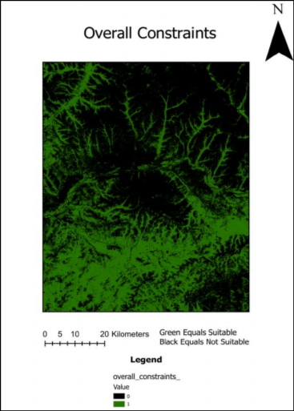

# Farmland Suitability Analysis (Ulaanbaatar, Mongolia)
GIS- och fjärranalysprojekt för att identifiera jordbrukslämpliga områden med Spatial Multi-Criteria Analysis (SMCA).

## Innehåll
- [Mål](#mål)
- [Studieområde](#studieområde)
- [Data och källor](#data-och-källor)
- [Metod](#metod)
- [SMCA-design](#smca-design)
- [Resultat](#resultat)
- [Begränsningar](#begränsningar)

---

## Mål
- Identifiera lämpliga områden för jordbruk i regionen kring Ulaanbaatar.
- Kombinera fjärranalys, terränganalys och hydrologisk modellering i en sammanhållen GIS-process.
- Ta fram en klassad lämplighetskarta (hög, medel, låg) som beslutsunderlag.

## Studieområde
Analysen omfattar området runt Ulaanbaatar, Mongoliet, där vatten är en kritisk begränsande faktor för jordbruk.

## Data och källor
- **Landsat 8 (USGS)**, 30 m
  - Användning: markanvändningsklassificering.
- **SRTM DEM (USGS)**, 30 m
  - Användning: lutning, flödesriktning, flödesackumulation och extraktion av vattendrag.

## Metod
 
1. Förbehandling av rasterdata och harmonisering av projektion.
2. Markanvändningsklassificering från Landsat 8.
3. DEM-korrigering (`Fill`) för att eliminera artificiella sänkor.
4. Beräkning av:
   - Slope (%)
   - Hydrologi (D8 flow direction, flow accumulation)
5. Extraktion av stream-nätverk med tröskelvärde för mer tillförlitligt vattenflöde.
6. Konstruktion av:
   - **Constraint-lager** (binary mask)
   - **Factor-lager** (kontinuerlig lämplighet)
7. Spatial Multi-Criteria Analysis (SMCA) och klassning av slutresultat.

## SMCA-design

### Constraints (exkluderade områden)
- Lutning > 15%
- Skog
- Urban mark
- Vatten/våtmark

### Factors (gradvis påverkan)
- Avstånd till vattendrag (närmare = mer lämpligt)
- Avstånd till städer (längre bort = mer lämpligt)

### Viktning
- Vattendrag: **0.7**
- Städer: **0.3**

Motivering: vattenåtkomst bedömdes som viktigast i studieregionens torra klimat.

## Resultat

- Slutkartan klassades i:
  - Hög lämplighet
  - Medelhög lämplighet
  - Låg lämplighet
- Högst lämplighet återfanns i områden med:
  - låg lutning
  - närhet till stabila vattendrag
  - utanför urban/skog/våtmark
- Projektet visar tydligt hur hydrologi och terräng styr jordbrukspotential i området.

## Begränsningar
- 30 m upplösning gör smala vattendrag svåra att klassificera exakt.
- Blandpixlar i Landsat kan ge osäkerhet i markklassning.
- Tröskelvärden och vikter är metodval som påverkar utfall.
